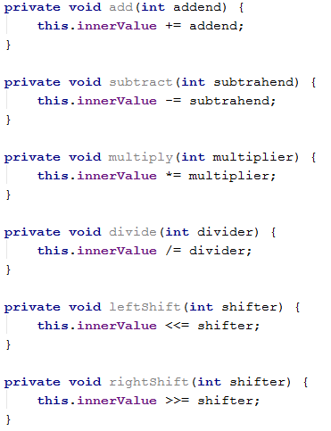

# **REFLECTIONS & ANNOTATIONS**
----------
-------

Solved problems from course exercises

-----------------

01. Harvesting Fields 

You are given a **RichSoilLand class** with lots of fields \(look at the provided skeleton\). Like the good farmer you are, you must harvest them. Harvesting means that you must print each field in a certain format \(see output).

**Input**

You will receive a maximum of 100 lines with one of the following commands:
-	**private** - print all private fields
-	**protected** - print all protected fields
-	**public** - print all public fields
-	**all** - print ALL declared fields
-	**HARVEST** - end the input

**Output**

For each command you must print the fields that have the given access modifier as described in the input section. The format in which the fields should be printed is:

>**"\<access modifier> \<field type> \<field name>"**

**Examples**

|  | Output                                                  |
| --- | --- |
| protected | protected String testString |
| HARVEST | protected double aDouble |
|  | protected byte testByte |
|  | protected StringBuilder aBuffer |
|  | protected BigInteger testBigNumber |
|  | protected float testFloat |
|  | protected Object testPredicate |
|  | protected Object fatherMotherObject |
|  | protected String moarString |
|  | protected Exception inheritableException |
|  | protected Stream moarStreamz |
||| 
| private | private int testInt |
| public | private long testLong |
| private | private Calendar aCalendar |
| HARVEST | private char testChar |
|  | private BigInteger testBigInt |
|  | private Thread aThread |
|  | private Object aPredicate |
|  | private Object hiddenObject |
|  | private String anotherString |
|  | private Exception internalException |
|  | private Stream secretStream |
|  | public double testDouble |
|  | public String aString |
|  | public StringBuilder aBuilder |
|  | public short testShort |
|  | public byte aByte |
|  | public float aFloat |
|  | public Thread testThread |
|  | public Object anObject |
|  | public int anotherIntBitesTheDust |
|  | public Exception justException |
|  | public Stream aStream |
|  | private int testInt |
|  | private long testLong |
|  | private Calendar aCalendar |
|  | private char testChar |
|  | private BigInteger testBigInt |
|  | private Thread aThread |
|  | private Object aPredicate |
|  | private Object hiddenObject |
|  | private String anotherString |
|  | private Exception internalException |
|  | private Stream secretStream |
|  | private int testInt |
|  | |
| all | public double testDouble |
| HARVEST | protected String testString |
|  | private long testLong |
|  | protected double aDouble |
|  | public String aString |
|  | private Calendar aCalendar |
|  | public StringBuilder aBuilder |
|  | private char testChar |
|  | public short testShort |
|  | protected byte testByte |
|  | public byte aByte |
|  | protected StringBuilder aBuffer |
|  | private BigInteger testBigInt |
|  | protected BigInteger testBigNumber |
|  | protected float testFloat |
|  | public float aFloat |
|  | private Thread aThread |
|  | public Thread testThread |
|  | private Object aPredicate |
|  | protected Object testPredicate |
|  | public Object anObject |
|  | private Object hiddenObject |
|  | protected Object fatherMotherObject |
|  | private String anotherString |
|  | protected String moarString |
|  | public int anotherIntBitesTheDust |
|  | private Exception internalException |
|  | protected Exception inheritableException |
|  | public Exception justException |
|  | public Stream aStream |
|  | protected Stream moarStreamz |
|  | private Stream secretStream |

[:baby_bottle: **SOLUTION**](https://github.com/SophiyaYO/ReflectionAndAnnotationExercise/tree/master/src/harvestingFields)

02. Black Box Integer

You are helping a buddy of yours who is still in the OOP Basics course - his name is Peshoslav (not to be mistaken with real people or trainers). He is rather slow and made a class with all private members. Your tasks are to instantiate an object from his class (always with start value 0) and then invoke the different methods it has. Your restriction is to not change anything in the class itself (consider it a black box). You can look at his class but don't touch anything! The class itself is called BlackBoxInt. It is a wrapper for the int primitive. The methods it has are:

**Input**

The input will consist of lines in the form:

>"**\<command name>_\<value>"**

**Example:** _add_115_

Input will always be valid and in the format described, so there is no need to check it explicitly. You stop receiving input when you encounter the command "END".

**Output**

Each command \(except the END one) should print the current value of innerValue of the BlackBoxInt object you instantiated. Don't cheat by overriding toString in the class - you must get the value from the private field.

**Examples**

Input | Output
---              | ---
add_999999 | 999999
subtract_19 | 999980
divide_4 | 249995
multiply_2 | 499990
rightShift_1 | 249995
leftShift_3 | 1999960
END |

[:sos: **SOLUTION**](src/blackBoxInteger/)

